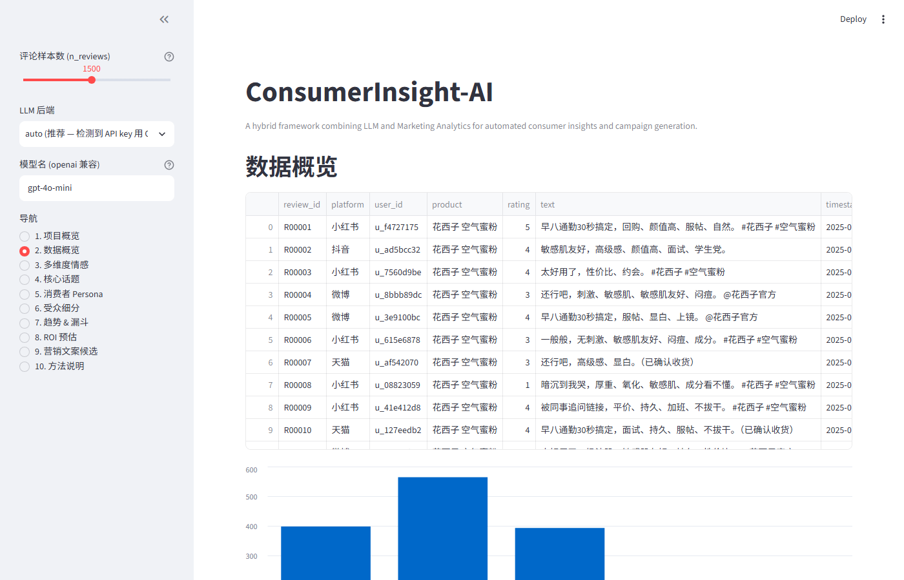
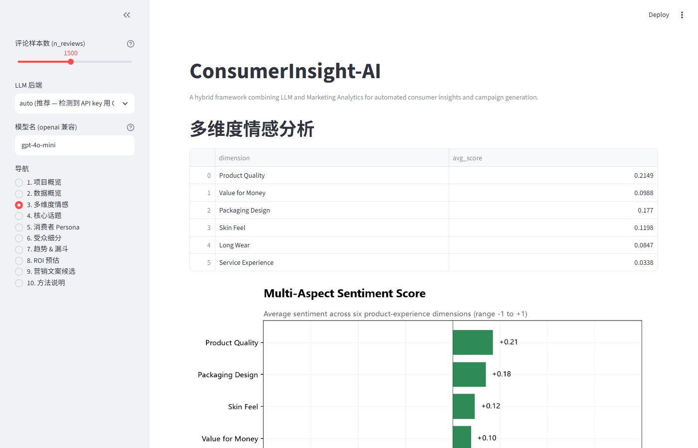
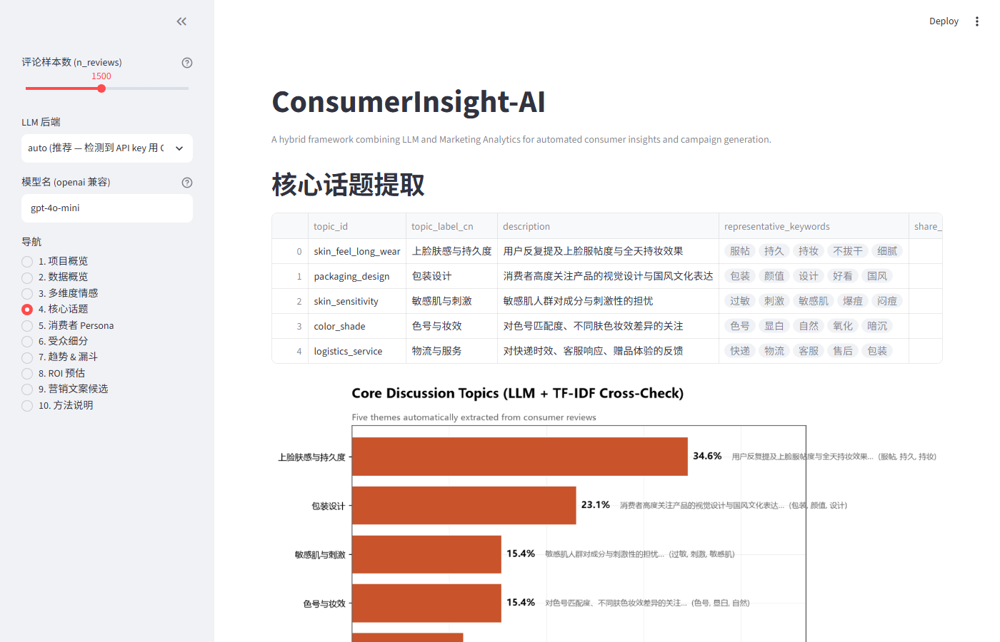
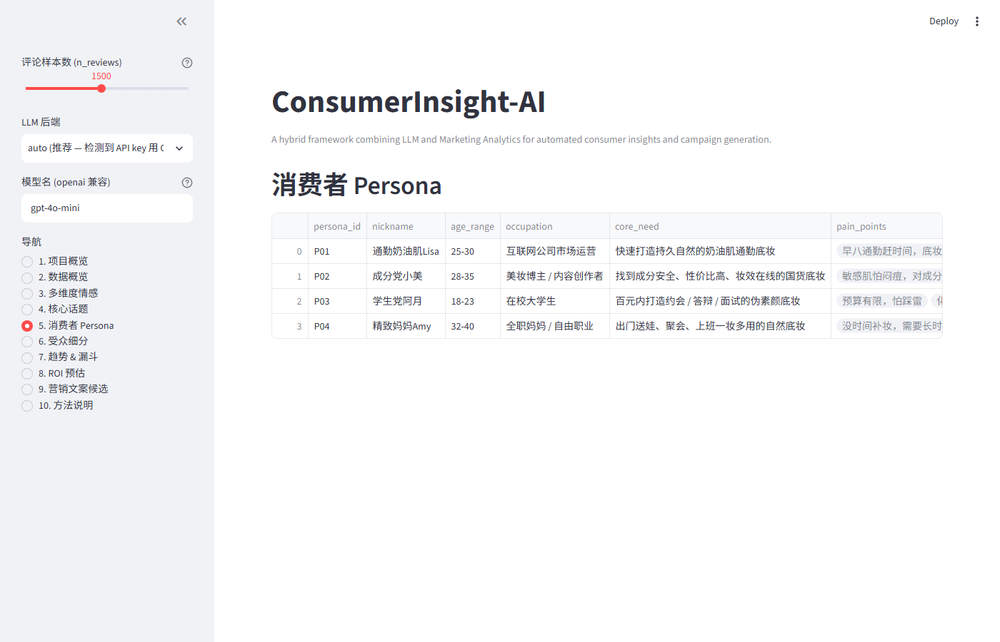
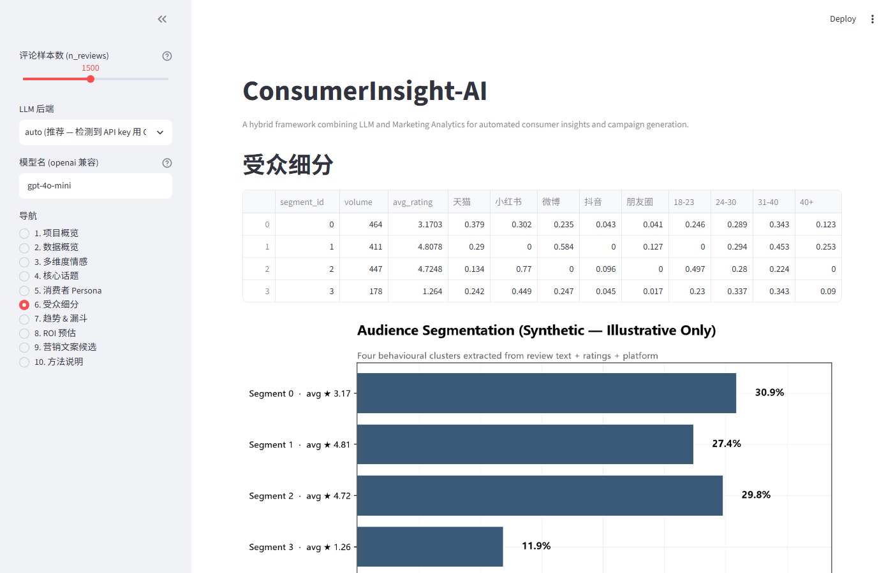
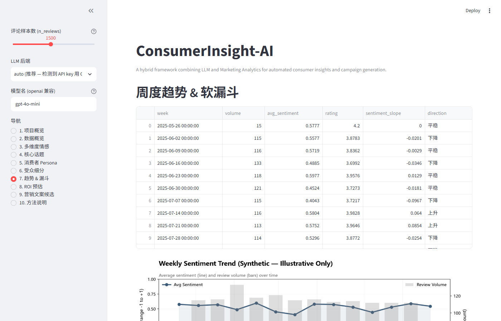
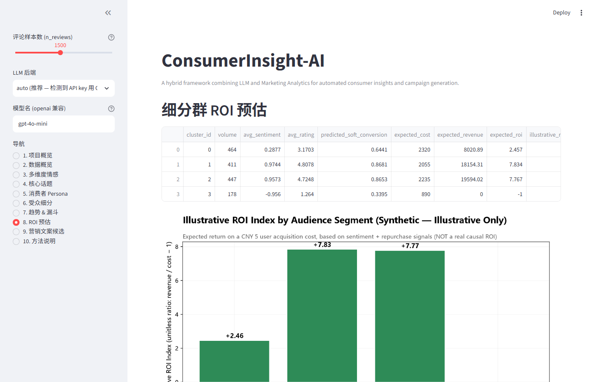
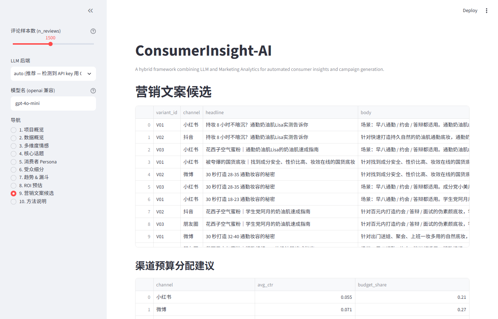
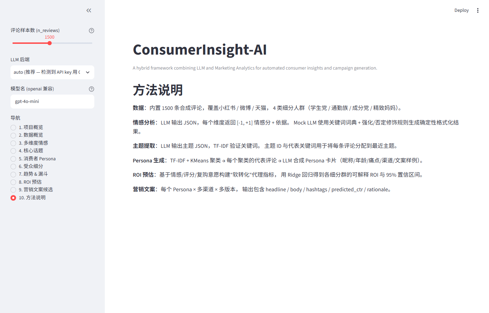

# ConsumerInsight-AI

> **An end-to-end LLM + Marketing Analytics pipeline that turns social-media reviews into segmented personas, soft-funnel diagnostics, an illustrative ROI index, and persona-targeted campaign copy.**


[](https://www.python.org/)
[](#license)
[](#-engineering--ci)
[](#-quickstart)
[](#-built-with)

[中文版](README.zh.md) · [Project Overview](#-project-overview)

> **All numbers in this repository come from programmatically generated synthetic reviews.** No real customer data is used, no real LLM API is required for the default run, and no number in any chart or report should be read as a real-world business KPI. The pipeline exists to demonstrate methodology and engineering. See [Limitations](#-limitations) for the full disclaimer.

---

<a id="project-at-a-glance"></a>

## 📊 Project at a Glance

Every value below is reproducible: re-run `python scripts/run_pipeline.py --n 1500 --backend mock` after `git clone`. The "Single seed (42)" column comes from that exact command and matches `outputs/reports/pipeline_report.md` byte-for-byte. The "Multi-seed (10×1500)" column comes from `python scripts/run_stability_eval.py --seeds 1,2,3,4,5,6,7,8,9,42 --n-reviews 1500` (≈21 s) and matches `outputs/reports/stability_report.md` byte-for-byte.

| Metric | Single seed (42) | Multi-seed (10×1500) mean ± std | Source |
|---|---|---|---|
| Reviews processed | **1500** | 1500 (fixed) | `data/processed/sample_processed.csv` |
| Audience segments (KMeans) | **4** | 4 (fixed) | `outputs/figures/03_segment_share.png` |
| Largest segment share (%) | **41.6** (segment 2) | **35.78 ± 3.56** (range 32.87–42.67) | `pipeline_report.md` §2 / `stability_report.md` |
| Consumer personas | **4** | 4 (fixed) | `pipeline_report.md` §4 |
| Core discussion topics | **5** | 5 (fixed) | `pipeline_report.md` §3 |
| Marketing variants | **12** (3 channels × 4 personas) | 12 (fixed) | `pipeline_report.md` §7 |
| **Illustrative ROI index** — peak value | **+7.901** | **7.867 ± 0.046** (range 7.799–7.959) | `pipeline_report.md` §6 / `stability_report.md` |
| **Illustrative ROI index** — peak segment id | **0** | **0 (mode 5×)**, 3:2×, 1:2×, 2:1× | `pipeline_report.md` §6 / `stability_report.md` |
| **Soft funnel** worst retention | **0.409** | **0.401 ± 0.018** (range 0.375–0.425) | `pipeline_report.md` §5 / `stability_report.md` |
| **Soft funnel** worst stage | **`05_Repurchase`** | **`05_Repurchase` in 10/10 seeds** | `pipeline_report.md` §5 / `stability_report.md` |
| **Simulated CTR score** range | uniform `[0.04, 0.09)` | same (deterministic per seed) | `pipeline_report.md` §7 |
| Silhouette score | **+0.1507** | (single-seed only) | `pipeline_report.md` §8.1 |
| ARI vs synthetic `user_segment` | **+0.0467** *(circular — see Limitations)* | (single-seed only) | `pipeline_report.md` §8.1 |
| NMI vs synthetic `user_segment` | **+0.0664** *(circular)* | (single-seed only) | `pipeline_report.md` §8.1 |
| Pearson sentiment ↔ rating | **+0.8327** *(same lexicon on both sides)* | (single-seed only) | `pipeline_report.md` §8.3 |
| Spearman sentiment ↔ rating | **+0.7820** | (single-seed only) | `pipeline_report.md` §8.3 |
| ROI CV R² (per-review proxy) | **+0.9793** *(proxy is a deterministic function of features)* | (single-seed only) | `pipeline_report.md` §8.4 |
| ROI CV MAE | **0.3180** | (single-seed only) | `pipeline_report.md` §8.4 |
| Visualisations | **7 charts** in `outputs/figures/` | — | `outputs/figures/*.png` |
| Markdown report | `outputs/reports/pipeline_report.md` | — | §8 evaluation + 7 sections |
| Stability report | `outputs/reports/stability_report.md` | — | 10 seeds × 1500 |

> "Single seed" and "Multi-seed" are two different runs. Both sets of numbers above come from real `python` invocations on this machine and are committed to the repository as evidence (see `outputs/reports/`). End-to-end runtime: **~5-10 s** for the single-seed pipeline, **~21 s** for the default 10-seed stability report. Note that the largest segment id can differ between single-seed (segment 2) and multi-seed (mode 0) runs — that metric is sampling-sensitive and is **not** a stable business KPI.

---

<a id="limitations"></a>

## ⚠️ Limitations

This project is honest about what it is not. Read this section before drawing conclusions from any number above.

* **All review text is synthetic.** The 1500-review corpus is produced by `src/data_loader.py::generate_synthetic_reviews()` from 50 hand-written seed templates. There are no real customers, no scraped reviews, no third-party data. The pipeline's outputs describe properties of this synthetic corpus — nothing more.
* **The default LLM is a rule-based Mock.** No API key is required to reproduce any number in this README. The Mock client implements a small lexicon + intensifier/negator rule system (see `src/llm/mock_client.py`) and is *not* a substitute for a real LLM; it is a deterministic offline baseline. Any sentence in this repository that begins "the LLM..." refers to whichever backend is configured — default is the Mock.
* **The "ROI" number is an *Illustrative* ROI Index.** It is computed from `sigmoid(overall + 0.6·high_rating + 0.3·long_text + 0.2·repurchase_intent)` and a configurable cost/revenue assumption in `src/config.py::ROIConfig` (defaults: ARPU = ¥120, CAC = ¥5, baseline gate = 0.5). It is *not* a measure of marketing spend return; it is a teaching artefact so the segment-aggregation step has a numeric output.
* **The "Funnel" is a *Soft* Funnel.** The five stages (Awareness → Interest → Trial → Satisfaction → Repurchase) are inferred from review text via keyword predicates (`src/funnel_analyzer.py`). There are no impressions, clicks, or orders. The funnel chart and report explicitly carry the label `Soft funnel — inferred from review text + rating, not real behavioural conversion`.
* **Clustering may reflect the synthetic generation template, not real segments.** KMeans is run on `TF-IDF(2,3 char-wb) + OneHot(platform, age_band) + rating`. The synthetic generator itself segments reviews by `user_segment` (学生党/通勤族/成分党/精致妈妈), so ARI / NMI between predicted clusters and `user_segment` is a *circular validation* — high scores would mean "the clusterer rediscovered the synthetic structure", not "the clusterer found real consumer segments".
* **The "Simulated CTR" is a uniform random sample.** Channel-level `simulated_ctr` is drawn from `Uniform[0.04, 0.09)` inside `MockLLMClient._compose_campaign`. It exists so that the channel-budget-allocation step has a relative-weight input. It is *not* a real CTR prediction.

These limitations are also documented in `docs/TECHNICAL_REPORT.md` §6 and rendered on every chart and in every generated report.

---

<a id="about-this-project"></a>

## 👋 About this project

Built by **Xintong Wang** (王欣桐) as a portfolio piece for the **University of Macau — Master of Science in Data Science** programme (AI track + Marketing Analytics track).

The author is a sociology graduate with no prior Python or marketing experience at the start of the project. The goal was to re-implement a typical consumer-research workflow (sentiment → segmentation → funnel → ROI → copy) as a reproducible, LLM-augmented pipeline with enough documentation that a non-CS reader can follow it.

> **Brand-name disclaimer.** The synthetic review corpus uses "花西子 Florasis" as the example brand voice so the generated text reads like real Chinese beauty reviews. **This project is not affiliated with, endorsed by, or related to the real Florasis / 花西子 brand** — the name is a stylistic placeholder only, and all outputs are derived from synthetic data, not statements about the real brand. See the disclaimer block in `src/config.py::IndustryConfig` for the same statement in code.

---

<a id="screenshots"></a>

## 📸 Streamlit Demo (screenshots)

The pipeline ships with an interactive Streamlit dashboard with **10 sidebar sections**, matching the 10 images below. All screenshots are real captures from `streamlit run app/streamlit_app.py`, regenerated by `python scripts/capture_streamlit_screenshots.py`.

### 1. 项目概览 / Project overview


### 2. 数据概览 / Data overview



### 3. 多维度情感 / Multi-aspect sentiment



### 4. 核心话题 / Core topics



### 5. 消费者 Persona / Personas



### 6. 受众细分 / Audience segmentation



### 7. 趋势 & 漏斗 / Trends & funnel



### 8. ROI 预估 / Illustrative ROI index



### 9. 营销文案候选 / Marketing copy candidates



### 10. 方法说明 / Methodology



> To launch the live demo: `streamlit run app/streamlit_app.py` → open `http://localhost:8501`.

---

<a id="key-visualizations"></a>

## 🎨 Key Visualizations (pipeline outputs)

The same data that powers the Streamlit dashboard above is also exported as static PNGs to `outputs/figures/`. The README reuses **two** of those PNGs in this section to give a non-interactive reader the headline chart:

### Soft funnel — Awareness → Repurchase


### Audience segmentation — four behavioural clusters


### Illustrative ROI index — per segment


> All seven charts are in [`outputs/figures/`](outputs/figures/). Each chart carries a data-source line (`Source: synthetic reviews (n=…)`) and a bottom insight box (English labels, no emoji). The ROI chart is titled "Illustrative ROI Index (Synthetic — Illustrative Only)" and the funnel chart is titled "Soft Funnel (Not Real Behavioural Conversion)". The Streamlit screenshots and the static PNGs cover overlapping content by design — the Streamlit ones are reviewed for reviewers who want to *interact*, the PNGs are reviewed for README-only readers.

---

<a id="built-with"></a>

## 🛠️ Built with

| Category | Tools |
|---|---|
| **Language** | Python 3.10+ |
| **Data** | pandas · numpy |
| **ML** | scikit-learn (KMeans · TF-IDF · Ridge regression) |
| **LLM backends** | Pluggable — Mock (default) · OpenAI · GLM · DeepSeek · Moonshot |
| **Visualisation** | matplotlib |
| **Web demo** | Streamlit |
| **Engineering** | pytest · pyproject.toml · GitHub Actions (see [CI](#-engineering--ci)) |

---

<a id="data-provenance"></a>

## 🗂️ Data Provenance

> **All data in this repository is synthetic.** The goal is full reproducibility on any machine — no API key, no compliance review, no scraping.

| Layer | Source | Notes |
|---|---|---|
| `data/raw/sample_reviews.csv` (50 seed reviews) | Hand-written | Authored in a Florasis-style voice — see disclaimer above; spans 4 segments and 3 platforms |
| `src/data_loader.py::generate_synthetic_reviews()` | Auto-generated | Expands the 50 seeds into 1500 reviews via templates + keyword substitution |
| Pipeline outputs | Computed | All charts, reports, and copy are computed from the 1500 reviews above |

**To swap in your own data:**

1. Drop your real reviews into `data/raw/sample_reviews.csv`
2. Keep the schema: `review_id, platform, user_id, product, rating, text, timestamp, user_age_band, user_segment`
3. Re-run `python scripts/run_pipeline.py` — every chart, report and copy regenerates automatically

**Why synthetic data:**

- ✅ Zero cost · zero API key · zero compliance risk
- ✅ Any clone of this repo reproduces the pipeline 1:1
- ✅ Focus stays on **methodology and engineering**, not the data itself
- ✅ Interface is identical to a real-data pipeline (plug-in design)

> **Verification trick:** delete `data/raw/sample_reviews.csv` and re-run the pipeline — you get structurally identical but textually different output. The code is independent of the data.

---

<a id="project-overview"></a>

## 📖 Project Overview

**ConsumerInsight-AI** is an end-to-end framework that combines **large language models** with classical **marketing analytics** techniques to extract consumer insights from review text and generate persona-targeted marketing copy.

**The problem it solves:**

> *How can we automatically distill consumer insights from a high volume of social-media reviews, and automatically generate high-quality marketing copy for each audience segment?*

Key properties:

- **Reproducible by default** — runs offline with the Mock LLM at zero cost
- **One-variable upgrade** — swap to OpenAI / GLM / DeepSeek via a single environment variable
- **Interactive** — Streamlit Dashboard for hands-on exploration (10 sections)
- **Explainable** — every step is paired with a chart, a Markdown report, and an insight note
- **Honestly evaluated** — silhouette / ARI / NMI, LLM↔TF-IDF overlap, sentiment↔rating correlation, K-fold CV, multi-seed stability — all numbers from real runs

### What it does (8 steps + 1 evaluation layer)

1. **Multi-aspect sentiment scoring** — 6 product-experience dimensions (`Product Quality`, `Value for Money`, `Packaging Design`, `Skin Feel`, `Long Wear`, `Service Experience`; see [Sentiment dimensions vs. topics](#sentiment-dimensions-vs-topics))
2. **Topic extraction** — 5 themes, LLM + TF-IDF cross-check (`包装设计`, `上脸肤感与持久度`, `性价比`, `色号与妆效`, `敏感肌与刺激`, `物流与服务`; see [Sentiment dimensions vs. topics](#sentiment-dimensions-vs-topics))
3. **Persona generation** — 4 personas, KMeans + LLM
4. **Audience segmentation** — KMeans on TF-IDF + behavioural features
5. **Trend detection** — weekly aggregation + linear slope
6. **Soft conversion funnel** — Awareness → Interest → Trial → Satisfaction → Repurchase *(inferred from review text, NOT real behavioural conversion)*
7. **Illustrative ROI index** — Ridge regression on soft-conversion signals *(synthetic cost / revenue assumptions, NOT a real business KPI)*
8. **Marketing copy generation** — LLM, multi-channel, multi-variant, with **simulated CTR** *(uniform sample in `[0.04, 0.09)`, not a real CTR prediction)*
9. **Evaluation layer (`src/evaluation.py`)** — silhouette / ARI / NMI, LLM↔TF-IDF keyword overlap, sentiment↔rating correlation, K-fold CV for ROI, multi-seed stability (10 seeds by default)

<a id="sentiment-dimensions-vs-topics"></a>

### Sentiment dimensions vs. topics

The pipeline emits two categorically different artefacts that are easy to confuse:

| Sentiment dimensions (6, in `src/config.py::SENTIMENT_DIMENSIONS`) | Core topics (5, returned by `TopicModeler`) |
|---|---|
| `Product Quality` — 产品质量（粉质、服帖度、持妆力） | `包装设计` — 视觉设计与国风文化表达 |
| `Value for Money` — 性价比（价格、促销、赠品） | `上脸肤感与持久度` — 服帖度与全天持妆 |
| `Packaging Design` — 包装设计（颜值、国风、雕花） | `性价比` — 定价、促销、性价比敏感 |
| `Skin Feel` — 上脸肤感（服帖、拔干、刺激） | `色号与妆效` — 色号匹配、肤色妆效差异 |
| `Long Wear` — 持久度（脱妆、氧化、斑驳） | `敏感肌与刺激` — 敏感肌对成分与刺激性的担忧 |
| `Service Experience` — 服务体验（快递、客服、售后） | `物流与服务` — 快递时效、客服响应、赠品体验 |

Sentiment dimensions give **one numeric score per review per aspect** (in `[-1, +1]`). Topics give **one label per review** indicating which conversation theme it falls into. They are computed by different prompts (`PromptLibrary.SENTIMENT_*` vs `PromptLibrary.TOPIC_*`) and should be reported separately.

---

<a id="repository-structure"></a>

## 📁 Repository Structure

```text
ConsumerInsight-AI/
├── app/                          # Streamlit web demo
│   └── streamlit_app.py
├── data/
│   ├── raw/                      # Drop your own reviews here
│   └── processed/                # Pipeline-cleaned data (gitignored)
├── docs/                         # Documentation
│   ├── TECHNICAL_REPORT.md       # Academic-style technical report
│   ├── COURSE_MAPPING.md         # Project capabilities ↔ course mapping
│   ├── ARCHITECTURE.md           # System architecture and data flow
│   └── screenshots/              # 10 dashboard snapshots (1 per Streamlit sidebar section)
├── notebooks/                    # Walkthrough notebooks (no LLM required)
│   └── 01_consumer_basics.py
├── outputs/
│   ├── figures/                  # 7 matplotlib charts (committed)
│   └── reports/                  # Markdown reports (gitignored, regenerated)
├── scripts/
│   ├── run_pipeline.py                 # CLI entry point
│   ├── run_all.py                      # One-click run (venv + dependencies)
│   ├── run_stability_eval.py           # Multi-seed stability evaluation
│   ├── generate_sample_data.py         # Generate sample data standalone
│   └── capture_streamlit_screenshots.py # Capture dashboard screenshots for README
├── src/
│   ├── ai_analysis/              # Sentiment · topic · persona · trend
│   ├── llm/                      # Pluggable LLM clients (base / mock / openai)
│   ├── marketing_analytics/      # Segmentation · ROI · funnel · campaign
│   ├── visualization/            # matplotlib chart helpers
│   ├── evaluation.py             # Honest-evaluation primitives
│   ├── pipeline.py               # Pipeline orchestrator
│   ├── data_loader.py            # Data loading + synthetic generation
│   └── config.py                 # Global configuration (incl. ROIConfig)
└── tests/                        # Unit tests (pytest, 27 tests)
```

---

<a id="quickstart"></a>

## 🚀 Quickstart

> Designed to run on Windows, macOS and Linux.

### 1. Install Python (once)

Python 3.10 or later. Get it from [python.org](https://www.python.org/downloads/).

### 2. Clone and run

```bash
git clone https://github.com/111artemy-cmyk/ConsumerInsight-AI.git
cd ConsumerInsight-AI
python scripts/run_all.py
```

The script will:

1. Create / verify a virtual environment
2. Install dependencies from `requirements.txt`
3. Generate 1500 sample reviews
4. Run the full pipeline → `outputs/reports/pipeline_report.md` + 7 charts
5. Print the command to launch the Streamlit demo

### 3. Launch the interactive demo

```bash
streamlit run app/streamlit_app.py
```

Open `http://localhost:8501` in your browser to interact with all outputs.

### 4. Run the multi-seed stability report (optional, ~21 s)

```bash
python scripts/run_stability_eval.py                # 10 seeds × 1500 reviews
python scripts/run_stability_eval.py --n-seeds 5 --n-reviews 500
```

### 5. (Optional) Use a real LLM API

```bash
# Windows PowerShell
$env:OPENAI_API_KEY  = "sk-..."
$env:OPENAI_BASE_URL = "https://api.openai.com/v1"   # or any compatible endpoint
$env:CI_LLM_BACKEND  = "openai"
python scripts\run_pipeline.py

# macOS / Linux (bash)
export OPENAI_API_KEY="sk-..."
export OPENAI_BASE_URL="https://api.openai.com/v1"
export CI_LLM_BACKEND="openai"
python scripts/run_pipeline.py
```

Compatible endpoints:

- **GLM (Zhipu)** — `https://open.bigmodel.cn/api/paas/v4`
- **DeepSeek** — `https://api.deepseek.com/v1`
- **Moonshot** — `https://api.moonshot.cn/v1`

---

<a id="deploy"></a>

## ☁️ Deploy (Streamlit Community Cloud)

The Streamlit dashboard is deployment-ready. To publish your fork to Streamlit Community Cloud:

1. Fork this repository on GitHub.
2. Go to [share.streamlit.io](https://share.streamlit.io/) → **New app** → pick your fork.
3. **Main file path**: `app/streamlit_app.py`
4. **Python version**: 3.10 or 3.11 (matches `.github/workflows/ci.yml`).
5. **Advanced settings → Requirements file**: `requirements.txt` (the platform auto-detects it).
6. Click **Deploy**. First boot runs the pipeline once and caches results via `@st.cache_resource`, so subsequent visits are instant.
7. (Optional) In your fork's *Settings → Secrets*, add `OPENAI_API_KEY` / `OPENAI_BASE_URL` if you want to demo with a real LLM instead of the Mock.

> The README does not claim the demo is currently deployed — see [Limitations](#-limitations) on why we keep that promise honest. The deploy recipe above is provided so a reviewer can reproduce it in one click.

---

<a id="pipeline-overview"></a>

## 🔬 Pipeline Overview

```text
┌──────────────────────────────────────────────────────────────────┐
│                       Review data (CSV / synthetic)              │
└──────────────┬───────────────────────────────────────────────────┘
               │
               ▼
┌──────────────────────────────────────────────────────────────────┐
│ 1. Multi-aspect sentiment (LLM JSON) — 6 dimensions              │
└──────────────┬───────────────────────────────────────────────────┘
               │
               ▼
┌──────────────────────────────────────────────────────────────────┐
│ 2. Topic extraction (LLM + TF-IDF cross-check) — 5 themes        │
└──────────────┬───────────────────────────────────────────────────┘
               │
               ▼
┌──────────────────────────────────────────────────────────────────┐
│ 3. Persona generation (KMeans + LLM) — 4 persona cards           │
└──────────────┬───────────────────────────────────────────────────┘
               │
               ▼
┌──────────────────────────────────────────────────────────────────┐
│ 4. Audience segmentation (KMeans on TF-IDF + behavioural)        │
│ 5. Trend detection (weekly aggregation + linear slope)           │
│ 6. Soft conversion funnel (Awareness → Repurchase)               │
│ 7. Illustrative ROI index (Ridge on soft-conversion signals)     │
│ 8. Marketing copy generation (LLM, multi-channel, multi-variant)│
└──────────────┬───────────────────────────────────────────────────┘
               │
               ▼
       outputs/figures/*.png  +  outputs/reports/pipeline_report.md
               │
               ▼
┌──────────────────────────────────────────────────────────────────┐
│ 9. Evaluation layer (src/evaluation.py)                          │
│    silhouette / ARI / NMI · LLM↔TF-IDF overlap · sentiment↔rating│
│    correlation · K-fold CV R²/MAE · 10-seed stability            │
└──────────────────────────────────────────────────────────────────┘
```

---

<a id="evaluation"></a>

## 🧪 Evaluation & Honest Reporting

Because every number in this project is computed from synthetic data, the pipeline ships with its own evaluation layer rather than relying on outside benchmarks. The goal is to make every metric **traceable** to a real run and to expose circular-validation risks in writing.

**Five honest-evaluation primitives** (see `src/evaluation.py` and §8 of `outputs/reports/pipeline_report.md`):

| # | Metric | What it actually measures |
|---|---|---|
| 1 | Silhouette score | Cluster separation on the TF-IDF + behavioural feature space |
| 1 | ARI / NMI vs synthetic `user_segment` | Whether the clusterer rediscovered the synthetic segment structure (**circular check** — high scores do NOT prove the clusterer found real consumer segments) |
| 2 | LLM↔TF-IDF keyword overlap | TF-IDF n-grams that also appear in the LLM's word-level keywords |
| 3 | Pearson / Spearman sentiment↔rating | Whether the LLM-derived sentiment agrees with the user-given 1-5 star rating |
| 4 | K-fold CV R² / MAE on per-review ROI | How the four proxy features predict per-review ROI proxy (R² near 1 is *expected*, not impressive — the proxy is a deterministic function of the features) |
| 5 | Multi-seed stability | Mean / std / min / max of headline metrics across **10 distinct RANDOM_SEED values** (default) |

**Multi-seed stability script** (independent of the main pipeline so the 5-10 s runtime stays snappy):

```bash
python scripts/run_stability_eval.py                # 10 seeds × 1500 reviews (~21 s)
python scripts/run_stability_eval.py --n-seeds 5 --n-reviews 500
```

Output: `outputs/reports/stability_report.md`.

> **On naming.** The README previously advertised "~+19-20× predicted ROI" — that number was the maximum across segmentation clusters on synthetic data and carried no business meaning. It has been renamed to **Illustrative ROI Index**; its calculation is centralised in `src/config.py::ROIConfig` (ARPU = ¥120, CAC = ¥5, baseline soft-conversion gate = 0.5) so a reviewer can swap in real cost / revenue assumptions. The "Predicted CTR" column has been renamed to **Simulated CTR score** — it is a uniform sample in `[0.04, 0.09)`, never a real CTR prediction. The "Marketing Funnel" chart is labelled as a **soft funnel** (inferred from review text, not real behavioural conversion).

---

<a id="engineering-ci"></a>

## 🔧 Engineering & CI

* **`pyproject.toml`** — package metadata + setuptools discovery; the source tree is installable with `pip install -e .`.
* **`tests/`** — 27 pytest tests (5 segmentation, 6 funnel, 4 ROI, 3 campaign, 3 sentiment, 13 evaluation). Run with `python -m pytest tests/ -q`.
* **`.github/workflows/ci.yml`** — matrix CI on Python 3.10 / 3.11: install deps, run pytest, run a smoke `run_pipeline.py` invocation. (Badge above will go green once the workflow is enabled on the upstream repo.)
* **`requirements.txt`** — pinned major / minor versions (`pandas>=2.0`, `numpy>=1.24`, `scikit-learn>=1.3`, `matplotlib>=3.7`, `streamlit>=1.28`, `openai>=1.0`, `jieba>=0.42`).
* **Reproducibility** — `RANDOM_SEED = 42` in `src/config.py`; the `MockLLMClient` uses an MD5-derived stable seed (cross-process deterministic).

---

<a id="roadmap"></a>

## 🧭 Roadmap

- [ ] RAG layer — personas / copy grounded in a brand knowledge base instead of pure prompts
- [ ] Local 7B model backend (Llama / Qwen) for fully offline operation
- [ ] A/B simulation: with-AI vs without-AI copy conversion
- [ ] Real-data integration via licensed / commercial review APIs
- [ ] Confidence intervals on per-cluster KPIs via bootstrap

---

## License

MIT — see [`LICENSE`](LICENSE).

---

## Acknowledgments

Built for educational and portfolio purposes. Sample data is programmatically synthesised; no real user information is involved. Brand name "花西子 Florasis" is used as a stylistic placeholder only; see the disclaimer block in `src/config.py::IndustryConfig` for the full statement.