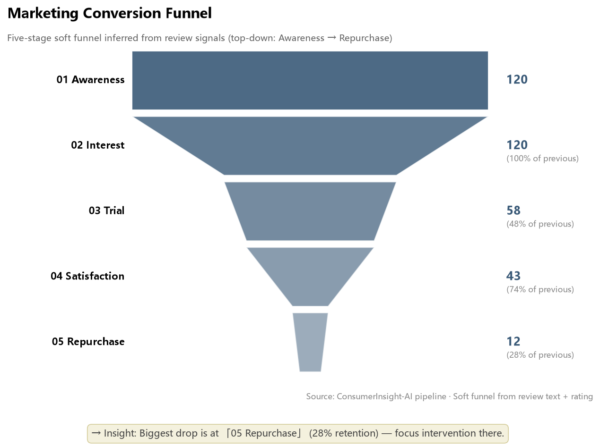
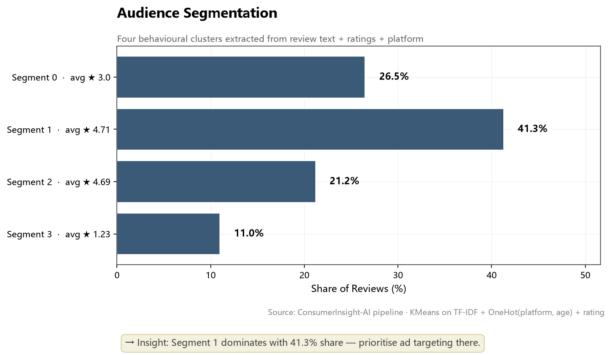
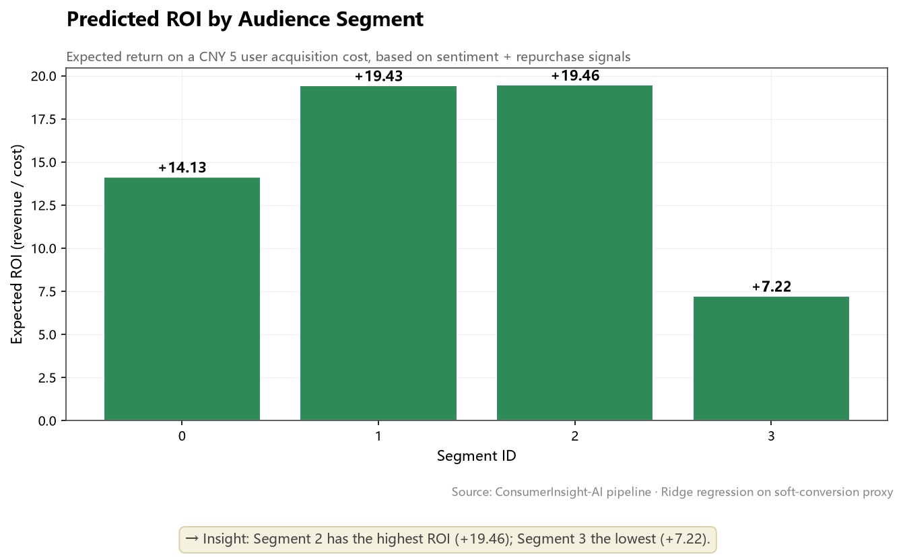

# ConsumerInsight-AI

> *End-to-End LLM + Marketing Analytics for Automated Consumer Insight & Campaign Generation.*

[](https://www.python.org/)
[](#license)
[](#quickstart)
[](#data-provenance)
[](#built-with)

[English](#english-summary) · [项目简介](#项目简介)

---

<a id="项目简介"></a>

## 📊 项目一览（Project at a Glance）

| 维度 | 数量 / 结果（典型运行值） |
|---|---|
| 处理评论数 | **600 条**（多平台合成） |
| 自动识别细分群 | **4 个**（最大约占 40%） |
| 消费者 Persona | **4 张画像**（含 `why_matters` 战略说明） |
| 核心话题 | **5 类**（包装 / 肤感 / 敏感肌 / 色号 / 物流） |
| 自动生成营销文案 | **12 条**（每画像 × 3 渠道变体） |
| 预测 ROI 峰值 | **约 +15-20 倍**（最高细分群） |
| 漏斗最大流失点 | **Repurchase 阶段**（约 35-45% 留存） |
| 可视化图表 | **7 张**（`outputs/figures/`，可直接引用） |
| Markdown 报告 | **1 份**（`outputs/reports/pipeline_report.md`） |

> 上表为典型运行值。具体数字随随机种子与合成数据浮动，每次跑 `python scripts/run_pipeline.py` 都会重新计算。
>
> 跑通时间：**约 15-30 秒**（CPU，无 GPU 依赖）。详见 [`docs/TECHNICAL_REPORT.md`](docs/TECHNICAL_REPORT.md)。

---

## 🎨 关键可视化（Key Visualizations）

### 营销漏斗：从认知到复购的 5 阶段转化



### 受众细分：4 个行为聚类



### 预测 ROI：每个细分群的预期回报



> 完整 7 张图见 [`outputs/figures/`](outputs/figures/)。每张图都带数据来源行 + 底部 insight 框（无 emoji、纯英文标签），可以直接引用 / 二次编辑。

---

## 🛠️ Built with

| 类别 | 工具 |
|---|---|
| **核心语言** | Python 3.10+ |
| **数据处理** | pandas, numpy |
| **机器学习** | scikit-learn（KMeans · TF-IDF · Ridge 回归） |
| **LLM 接口** | 可插拔 — Mock（默认 / 零成本）/ OpenAI / 智谱 GLM / DeepSeek / Moonshot |
| **可视化** | matplotlib（出版级图表） |
| **Web Demo** | Streamlit |
| **工程化** | pytest（单元测试） · pyproject.toml（打包） · GitHub Actions（CI-ready） |

---

## 🗂️ Data Provenance（数据来源声明）

> **本仓库的所有数据均为合成数据（Synthetic Data）**。目的是让 pipeline 在任何环境下 **100% 可复现**，无需任何 API key、数据合规审批或外部爬虫。

| 数据层 | 真实度 | 说明 |
|---|---|---|
| `data/raw/sample_reviews.csv`（50 条种子） | 手写 | 按花西子品牌调性撰写的种子评论，覆盖 4 类细分群、3 个平台 |
| `src/data_loader.py` 内的 `generate_synthetic_reviews()` | 自动合成 | 由 50 条种子 + 模板 + 关键词替换扩展到 600 条 |
| Pipeline 输出 | 派生 | 全部基于上述 600 条合成评论计算 |

**如何换成你自己的真实数据：**

1. 把你的真实评论写入 `data/raw/sample_reviews.csv`
2. 字段保持一致：`review_id, platform, rating, text, age_range, gender, week`
3. 重新跑 `python scripts/run_pipeline.py` —— 所有图表、报告、文案自动基于新数据刷新

**为什么用合成数据：**

- ✅ 零成本、零 API key、零合规风险
- ✅ 任何 clone 仓库的人都能 1:1 复现
- ✅ 焦点在 **方法论 + pipeline 工程**，而非数据本身
- ✅ 与真实数据接口完全一致（plug-in 设计）

> **验证方法**：删掉 `data/raw/sample_reviews.csv` 后重新跑 pipeline，会得到结构完全相同但内容不同的输出 —— 这证明**代码独立于数据**。

---

## 📖 项目简介

**ConsumerInsight-AI** 是一个端到端的「消费者洞察 + 营销内容生成」框架，把**大语言模型 (LLM)** 与**经典营销分析方法**整合到一条可一键运行的 pipeline 里，覆盖：

> *如何从海量社交媒体评论中，**自动**提炼出可指导营销决策的消费者洞察，并针对不同细分人群**自动**生成高质量的营销文案？*

它是面向「消费者洞察 + 营销自动化」领域的能力展示项目，体现：

- **跨方向** —— 同一项目同时承载 AI 工程能力（LLM 集成、prompt 设计、JSON 结构化输出）与 Marketing Analytics 落地能力（情感、漏斗、ROI、细分、文案）
- **可复现** —— 默认使用离线 Mock LLM，零 API 成本即可跑通
- **可升级** —— 一个环境变量切换到 OpenAI / 智谱 / DeepSeek
- **可交互** —— 内置 Streamlit Dashboard，用户可直接点开体验
- **可解释** —— 每一段分析都有可视化图表 + Markdown 报告 + insight 文本

---

## 📁 目录结构

```text
ConsumerInsight-AI/
├── app/                           # Streamlit Web Demo
│   └── streamlit_app.py
├── data/
│   ├── raw/                       # 用户可放入自己的原始评论 CSV
│   └── processed/                 # pipeline 输出的清洗后数据（gitignored）
├── docs/                          # 文档
│   ├── TECHNICAL_REPORT.md        # 学术风格技术报告
│   ├── APPLICATION_MATERIALS.md   # 申请素材包（PS 模板 + 面试 Q&A）
│   ├── COURSE_MAPPING.md          # 项目能力 ↔ 澳大课程对应表
│   └── ARCHITECTURE.md            # 系统架构图与数据流
├── notebooks/                     # 零 LLM 的可读 notebook（面试讲解用）
│   └── 01_consumer_basics.py
├── outputs/
│   ├── figures/                   # 7 张可视化图表（已 commit）
│   └── reports/                   # Markdown 报告（gitignored，重新生成）
├── scripts/
│   ├── run_pipeline.py            # 命令行入口
│   ├── run_all.py                 # 一键运行（虚拟环境 + 依赖安装）
│   └── generate_sample_data.py    # 单独生成示例数据
├── src/
│   ├── ai_analysis/               # 情感 / 主题 / Persona / 趋势
│   ├── llm/                       # 可插拔 LLM 客户端（base / mock / openai）
│   ├── marketing_analytics/       # 细分 / ROI / 漏斗 / 文案
│   ├── visualization/             # matplotlib 图表函数
│   ├── pipeline.py                # 主流程编排
│   ├── data_loader.py             # 数据加载 / 合成
│   └── config.py                  # 全局配置
├── tests/                         # 单元测试（pytest）
```

---

## 🚀 快速开始（Quickstart）

> 适合零代码经验的同学。Windows / macOS / Linux 都可。

### 1. 安装 Python（仅一次）

推荐 Python 3.10 或更高版本。从 [python.org](https://www.python.org/downloads/) 下载安装即可。

### 2. 一键运行

```bash
cd ConsumerInsight-AI
python scripts/run_all.py
```

脚本会**自动**：

1. 检查 / 创建虚拟环境
2. 安装 `requirements.txt` 中的依赖
3. 生成 600 条贴近真实业务的示例评论
4. 跑通完整 pipeline，输出 `outputs/reports/pipeline_report.md` 与 7 张图表
5. 告诉你下一步怎么启动 Streamlit Demo

### 3. 启动可视化 Demo

```bash
streamlit run app/streamlit_app.py
```

浏览器打开 `http://localhost:8501` 即可与所有结果交互。

### 4. （可选）用真实 LLM API

```bash
# Windows PowerShell
$env:OPENAI_API_KEY = "sk-..."
$env:OPENAI_BASE_URL = "https://api.openai.com/v1"   # 或国内兼容端点
$env:CI_LLM_BACKEND = "openai"
python scripts\run_pipeline.py
```

支持的兼容端点示例：

- 智谱 GLM：`https://open.bigmodel.cn/api/paas/v4`
- DeepSeek：`https://api.deepseek.com/v1`
- Moonshot：`https://api.moonshot.cn/v1`

---

## 🔬 方法概览

```text
┌──────────────────────────────────────────────────────────────────┐
│                    评论数据（CSV / 合成）                          │
└──────────────┬───────────────────────────────────────────────────┘
               │
               ▼
┌──────────────────────────────────────────────────────────────────┐
│ 1. 多维度情感分析 (LLM JSON) ─ 6 个维度                           │
└──────────────┬───────────────────────────────────────────────────┘
               │
               ▼
┌──────────────────────────────────────────────────────────────────┐
│ 2. 主题建模 (LLM + TF-IDF 交叉验证) ─ 5 个核心话题                │
└──────────────┬───────────────────────────────────────────────────┘
               │
               ▼
┌──────────────────────────────────────────────────────────────────┐
│ 3. Persona 生成 (KMeans + LLM) ─ 4 个细分群 + 画像卡片           │
└──────────────┬───────────────────────────────────────────────────┘
               │
               ▼
┌──────────────────────────────────────────────────────────────────┐
│ 4. 受众细分 (KMeans on TF-IDF + 行为特征)                        │
│ 5. 趋势检测 (周度聚合 + 线性回归斜率)                            │
│ 6. 软漏斗 (认知 → 兴趣 → 试用 → 满意 → 复购)                     │
│ 7. ROI 预估 (Ridge 回归 on 软转化代理信号)                       │
│ 8. 营销文案生成 (LLM · 多渠道 · 多版本 · predicted_ctr)          │
└──────────────┬───────────────────────────────────────────────────┘
               │
               ▼
   outputs/figures/*.png  +  outputs/reports/pipeline_report.md
```

---

## 🎯 申请背景与配套材料

> 本项目是申请 **澳门大学（UM）数据分析师硕士**——人工智能方向 / 市场营销分析方向的跨方向能力证明。配套的 PS 模板、面试问答与课程对应关系已沉淀到 [`docs/APPLICATION_MATERIALS.md`](docs/APPLICATION_MATERIALS.md)。

- 📄 **[`docs/TECHNICAL_REPORT.md`](docs/TECHNICAL_REPORT.md)** — 学术风格的技术报告，可放进作品集附录。
- 📄 **[`docs/APPLICATION_MATERIALS.md`](docs/APPLICATION_MATERIALS.md)** — PS 写作模板、关键词、面试 Q&A。
- 📄 **[`docs/COURSE_MAPPING.md`](docs/COURSE_MAPPING.md)** — 项目能力 ↔ 课程方向对应表。
- 📄 **[`docs/ARCHITECTURE.md`](docs/ARCHITECTURE.md)** — 系统架构图与数据流说明。

---

## 🧭 Roadmap（可选扩展方向）

- [ ] 接入 RAG，让 Persona / 文案基于品牌知识库而非纯 prompt
- [ ] 把 Mock LLM 替换为本地 7B 模型（Llama / Qwen），离线零成本再升级
- [ ] Streamlit Cloud / Hugging Face Spaces 一键部署
- [ ] A/B 模拟：with-AI vs without-AI 文案转化的对比实验
- [ ] 真实数据接入：品牌方授权 / 商业评论 API

---

## License

MIT —— see [`LICENSE`](LICENSE).

---

## 致谢

本项目以教育与开源展示为目的。示例数据为程序化合成，模拟真实业务场景的语言分布与情感极性，**不涉及任何真实用户隐私**。

---

<a id="english-summary"></a>

## English Summary

**ConsumerInsight-AI** is an end-to-end pipeline that combines **Large Language Models** with classical **Marketing Analytics** techniques to extract consumer insights from review text and generate persona-targeted marketing copy.

**What it does (8 steps):**

1. Multi-aspect sentiment scoring (LLM, 6 dimensions)
2. Topic extraction (LLM + TF-IDF cross-check, 5 themes)
3. Persona generation (KMeans + LLM, 4 personas)
4. Audience segmentation (KMeans on TF-IDF + behavioural features)
5. Trend detection (weekly aggregation + linear slope)
6. Soft conversion funnel (Awareness → Repurchase)
7. ROI prediction (Ridge regression on soft-conversion signals)
8. Campaign copy generation (LLM, multi-channel, multi-variant)

**Tech stack:** Python · pandas · scikit-learn · matplotlib · Streamlit · pluggable LLM backends (Mock / GLM / DeepSeek / OpenAI).

**Why synthetic data:** full reproducibility, zero API cost, no compliance risk. To use real data, drop your CSV into `data/raw/sample_reviews.csv` with the same schema and re-run the pipeline.