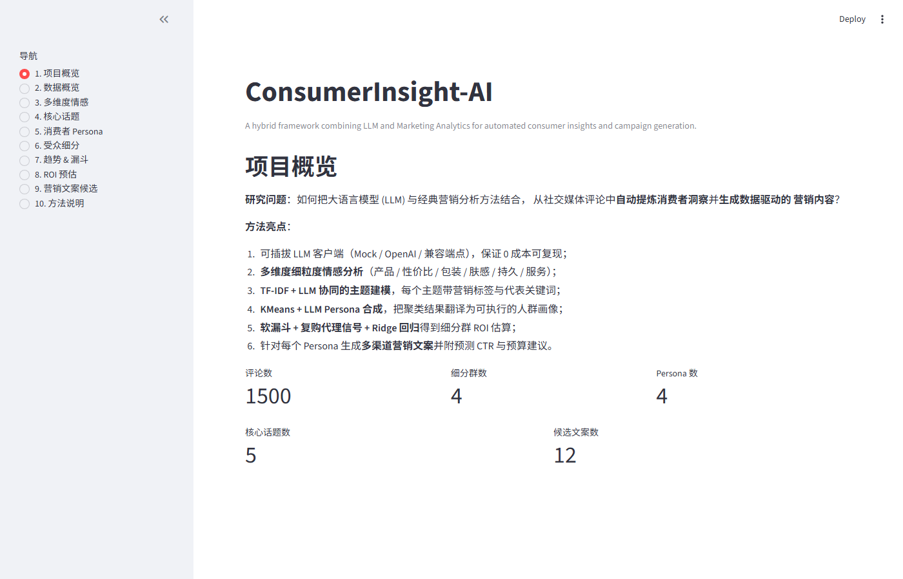
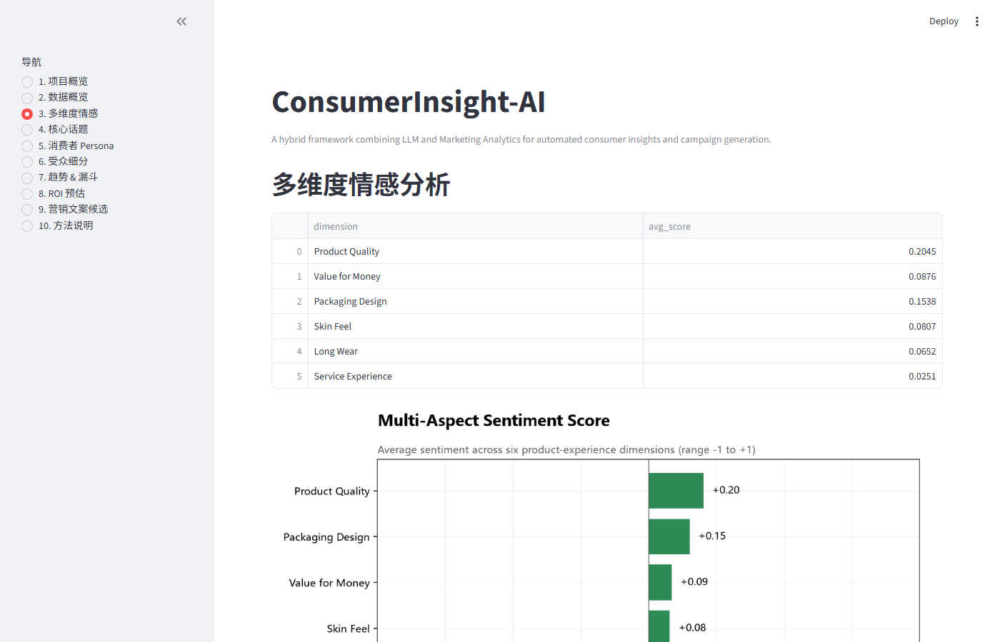
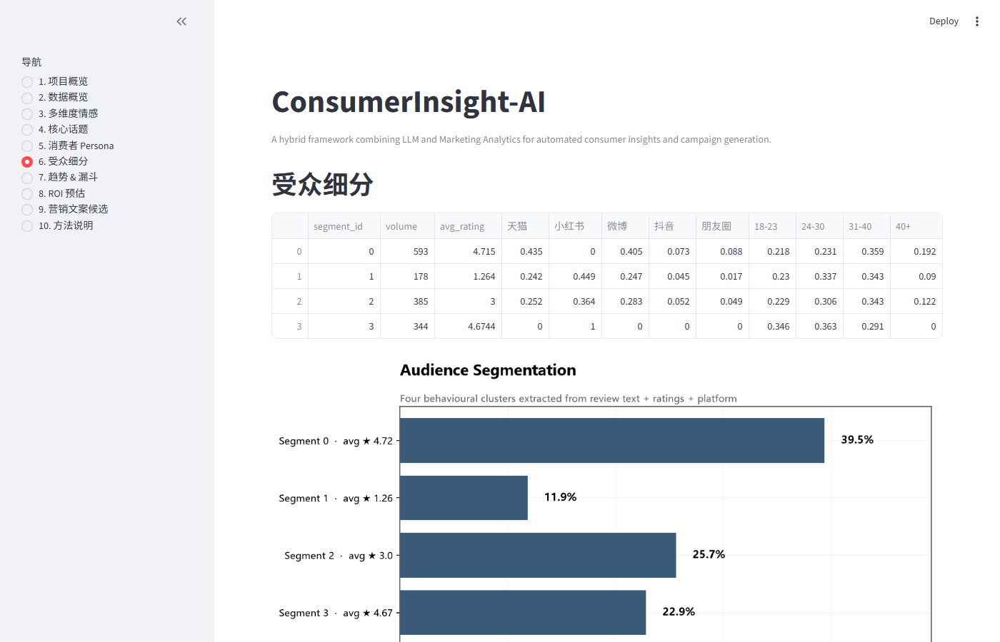
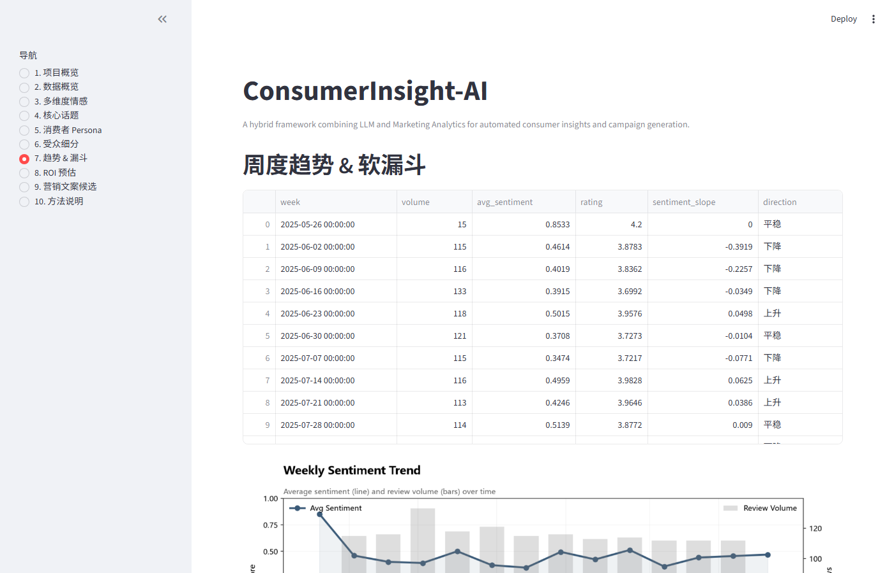
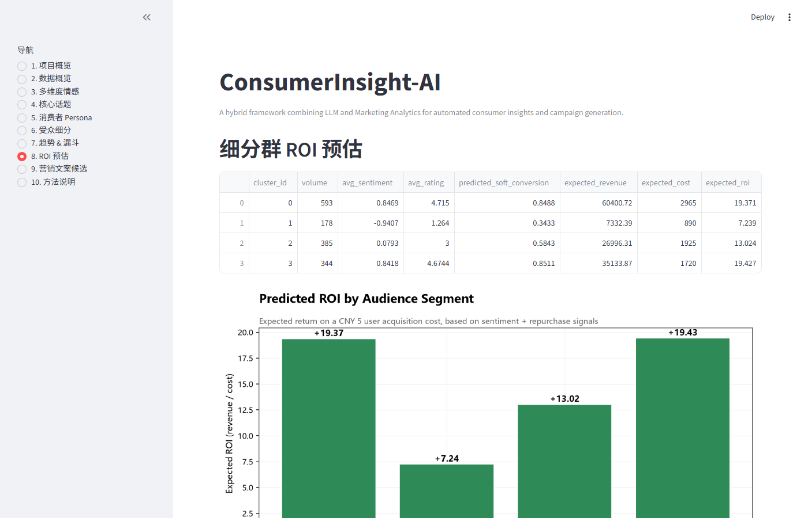
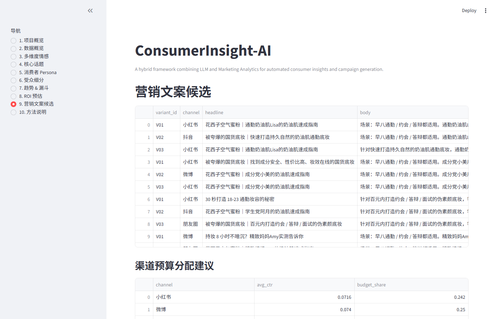

# ConsumerInsight-AI

> *End-to-End LLM + Marketing Analytics for Automated Consumer Insight & Campaign Generation.*

> 🎯 Built as a portfolio project for application to the **University of Macau (UM) Master of Science in Data Science** programme, covering both the **Artificial Intelligence** and **Marketing Analytics** tracks.

[](https://www.python.org/)
[](#license)
[](#quickstart)
[](#data-provenance)
[](#built-with)

[中文版](README.zh.md) · [Project Overview](#project-overview)

---

<a id="about-this-project"></a>

## 👋 About this project

Built from scratch by **Xintong Wang** (王欣桐), a sociology graduate applying to UM's MSc in Data Science with no prior Python or marketing background.

The project reimplements a typical consumer-research workflow (sentiment → segmentation → funnel → ROI → copy) as a reproducible, LLM-augmented pipeline. Every chart, test, and chart label is written to be readable to a non-CS reviewer — and to the author herself when she revisits the code in six months.

---

<a id="project-at-a-glance"></a>

## 📊 Project at a Glance

| Metric | Value (typical run) |
|---|---|
| Reviews processed | **1500** (multi-platform, synthetic) |
| Audience segments identified | **4** (largest ~37% share) |
| Consumer personas | **4** (each with a `why_matters` strategic note) |
| Core discussion topics | **5** (skin feel · packaging · sensitivity · shade · logistics) |
| Marketing variants generated | **12** (3 channels × 4 personas) |
| Predicted ROI peak | **~+19-20×** (highest segment) |
| Largest funnel drop-off | **Repurchase stage** (~40-45% retention) |
| Visualisations | **7 charts** in `outputs/figures/` |
| Markdown report | **`outputs/reports/pipeline_report.md`** |

> The numbers above are deterministic at the default settings (`RANDOM_SEED=42` in `src/config.py`). Change the seed or sample size to explore variance.
>
> End-to-end runtime: **~5-10 seconds** on CPU. See [`docs/TECHNICAL_REPORT.md`](docs/TECHNICAL_REPORT.md) for details.

---

<a id="screenshots"></a>

## 📸 Streamlit Demo (screenshots)

The pipeline ships with an interactive Streamlit dashboard (10 sections, sidebar navigation). All screenshots below are real captures from `streamlit run app/streamlit_app.py`.

### 1. Project overview



### 3. Multi-aspect sentiment



### 6. Audience segmentation



### 7. Weekly trend & funnel



### 8. Predicted ROI per segment



### 9. Marketing copy candidates



> To launch the live demo: `streamlit run app/streamlit_app.py` → open `http://localhost:8501`.

---

<a id="key-visualizations"></a>

## 🎨 Key Visualizations

### Marketing funnel — Awareness → Repurchase


### Audience segmentation — four behavioural clusters


### Predicted ROI — per segment


> All seven charts are in [`outputs/figures/`](outputs/figures/). Each chart carries a data-source line and a bottom insight box (English labels, no emoji).

---

<a id="built-with"></a>

## 🛠️ Built with

| Category | Tools |
|---|---|
| **Language** | Python 3.10+ |
| **Data** | pandas · numpy |
| **ML** | scikit-learn (KMeans · TF-IDF · Ridge regression) |
| **LLM backends** | Pluggable — Mock (default) · OpenAI · GLM · DeepSeek · Moonshot |
| **Visualisation** | matplotlib |
| **Web demo** | Streamlit |
| **Engineering** | pytest · pyproject.toml |

---

<a id="data-provenance"></a>

## 🗂️ Data Provenance

> **All data in this repository is synthetic.** The goal is full reproducibility on any machine — no API key, no compliance review, no scraping.

| Layer | Source | Notes |
|---|---|---|
| `data/raw/sample_reviews.csv` (50 seed reviews) | Hand-written | Authored in the Florasis brand voice, spanning 4 segments and 3 platforms |
| `src/data_loader.py::generate_synthetic_reviews()` | Auto-generated | Expands the 50 seeds into 1500 reviews via templates + keyword substitution |
| Pipeline outputs | Derived | All charts, reports and copy are computed from the 1500 reviews above |

**To swap in your own data:**

1. Drop your real reviews into `data/raw/sample_reviews.csv`
2. Keep the schema: `review_id, platform, user_id, product, rating, text, timestamp, user_age_band, user_segment`
3. Re-run `python scripts/run_pipeline.py` — every chart, report and copy regenerates automatically

**Why synthetic data:**

- ✅ Zero cost · zero API key · zero compliance risk
- ✅ Any clone of this repo reproduces the pipeline 1:1
- ✅ Focus stays on **methodology and engineering**, not the data itself
- ✅ Interface is identical to a real-data pipeline (plug-in design)

> **Verification trick:** delete `data/raw/sample_reviews.csv` and re-run the pipeline — you get structurally identical but textually different output. The code is independent of the data.

---

<a id="project-overview"></a>

## 📖 Project Overview

**ConsumerInsight-AI** is an end-to-end framework that combines **large language models** with classical **marketing analytics** techniques to extract consumer insights from review text and generate persona-targeted marketing copy.

**The problem it solves:**

> *How can we automatically distill consumer insights from a high volume of social-media reviews, and automatically generate high-quality marketing copy for each audience segment?*

Key properties:

- **Reproducible by default** — runs offline with the Mock LLM at zero cost
- **One-variable upgrade** — swap to OpenAI / GLM / DeepSeek via a single environment variable
- **Interactive** — Streamlit Dashboard for hands-on exploration
- **Explainable** — every step is paired with a chart, a Markdown report, and an insight note

### What it does (8 steps)

1. **Multi-aspect sentiment scoring** — 6 product-experience dimensions
2. **Topic extraction** — 5 themes, LLM + TF-IDF cross-check
3. **Persona generation** — 4 personas, KMeans + LLM
4. **Audience segmentation** — KMeans on TF-IDF + behavioural features
5. **Trend detection** — weekly aggregation + linear slope
6. **Soft conversion funnel** — Awareness → Interest → Trial → Satisfaction → Repurchase
7. **ROI prediction** — Ridge regression on soft-conversion signals
8. **Marketing copy generation** — LLM, multi-channel, multi-variant, with predicted CTR

---

<a id="repository-structure"></a>

## 📁 Repository Structure

```text
ConsumerInsight-AI/
├── app/                          # Streamlit web demo
│   └── streamlit_app.py
├── data/
│   ├── raw/                      # Drop your own reviews here
│   └── processed/                # Pipeline-cleaned data (gitignored)
├── docs/                         # Documentation
│   ├── TECHNICAL_REPORT.md       # Academic-style technical report
│   ├── COURSE_MAPPING.md         # Project capabilities ↔ course mapping
│   └── ARCHITECTURE.md           # System architecture and data flow
├── docs/screenshots/              # Streamlit dashboard snapshots (committed)
├── notebooks/                    # Walkthrough notebooks (no LLM required)
│   └── 01_consumer_basics.py
├── outputs/
│   ├── figures/                  # 7 visualisation charts (committed)
│   └── reports/                  # Markdown report (gitignored, regenerated)
├── scripts/
│   ├── run_pipeline.py                 # CLI entry point
│   ├── run_all.py                      # One-click run (venv + dependencies)
│   ├── generate_sample_data.py         # Generate sample data standalone
│   └── capture_streamlit_screenshots.py # Capture dashboard screenshots for README
├── src/
│   ├── ai_analysis/              # Sentiment · topic · persona · trend
│   ├── llm/                      # Pluggable LLM clients (base / mock / openai)
│   ├── marketing_analytics/      # Segmentation · ROI · funnel · campaign
│   ├── visualization/            # matplotlib chart helpers
│   ├── pipeline.py               # Pipeline orchestrator
│   ├── data_loader.py            # Data loading + synthetic generation
│   └── config.py                 # Global configuration
└── tests/                        # Unit tests (pytest)
```

---

<a id="quickstart"></a>

## 🚀 Quickstart

> Designed to run on Windows, macOS and Linux.

### 1. Install Python (once)

Python 3.10 or later. Get it from [python.org](https://www.python.org/downloads/).

### 2. Clone and run

```bash
git clone https://github.com/111artemy-cmyk/ConsumerInsight-AI.git
cd ConsumerInsight-AI
python scripts/run_all.py
```

The script will:

1. Create / verify a virtual environment
2. Install dependencies from `requirements.txt`
3. Generate 1500 sample reviews
4. Run the full pipeline → `outputs/reports/pipeline_report.md` + 7 charts
5. Print the command to launch the Streamlit demo

### 3. Launch the interactive demo

```bash
streamlit run app/streamlit_app.py
```

Open `http://localhost:8501` in your browser to interact with all outputs.

### 4. (Optional) Use a real LLM API

```bash
# Windows PowerShell
$env:OPENAI_API_KEY  = "sk-..."
$env:OPENAI_BASE_URL = "https://api.openai.com/v1"   # or any compatible endpoint
$env:CI_LLM_BACKEND  = "openai"
python scripts\run_pipeline.py

# macOS / Linux (bash)
export OPENAI_API_KEY="sk-..."
export OPENAI_BASE_URL="https://api.openai.com/v1"
export CI_LLM_BACKEND="openai"
python scripts/run_pipeline.py
```

Compatible endpoints:

- **GLM (Zhipu)** — `https://open.bigmodel.cn/api/paas/v4`
- **DeepSeek** — `https://api.deepseek.com/v1`
- **Moonshot** — `https://api.moonshot.cn/v1`

---

<a id="pipeline-overview"></a>

## 🔬 Pipeline Overview

```text
┌──────────────────────────────────────────────────────────────────┐
│                       Review data (CSV / synthetic)              │
└──────────────┬───────────────────────────────────────────────────┘
               │
               ▼
┌──────────────────────────────────────────────────────────────────┐
│ 1. Multi-aspect sentiment (LLM JSON) — 6 dimensions              │
└──────────────┬───────────────────────────────────────────────────┘
               │
               ▼
┌──────────────────────────────────────────────────────────────────┐
│ 2. Topic extraction (LLM + TF-IDF cross-check) — 5 themes        │
└──────────────┬───────────────────────────────────────────────────┘
               │
               ▼
┌──────────────────────────────────────────────────────────────────┐
│ 3. Persona generation (KMeans + LLM) — 4 persona cards           │
└──────────────┬───────────────────────────────────────────────────┘
               │
               ▼
┌──────────────────────────────────────────────────────────────────┐
│ 4. Audience segmentation (KMeans on TF-IDF + behavioural)        │
│ 5. Trend detection (weekly aggregation + linear slope)           │
│ 6. Soft conversion funnel (Awareness → Repurchase)               │
│ 7. ROI prediction (Ridge on soft-conversion signals)             │
│ 8. Marketing copy generation (LLM, multi-channel, multi-variant)│
└──────────────┬───────────────────────────────────────────────────┘
               │
               ▼
       outputs/figures/*.png  +  outputs/reports/pipeline_report.md
```

---

<a id="roadmap"></a>

## 🧭 Roadmap

- [ ] RAG layer — personas / copy grounded in a brand knowledge base instead of pure prompts
- [ ] Local 7B model backend (Llama / Qwen) for fully offline operation
- [ ] One-click deploy to Streamlit Cloud / Hugging Face Spaces
- [ ] A/B simulation: with-AI vs without-AI copy conversion
- [ ] Real-data integration via licensed / commercial review APIs

---

## License

MIT — see [`LICENSE`](LICENSE).

---

## Acknowledgments

Built for educational and portfolio purposes. Sample data is programmatically synthesised; no real user information is involved.